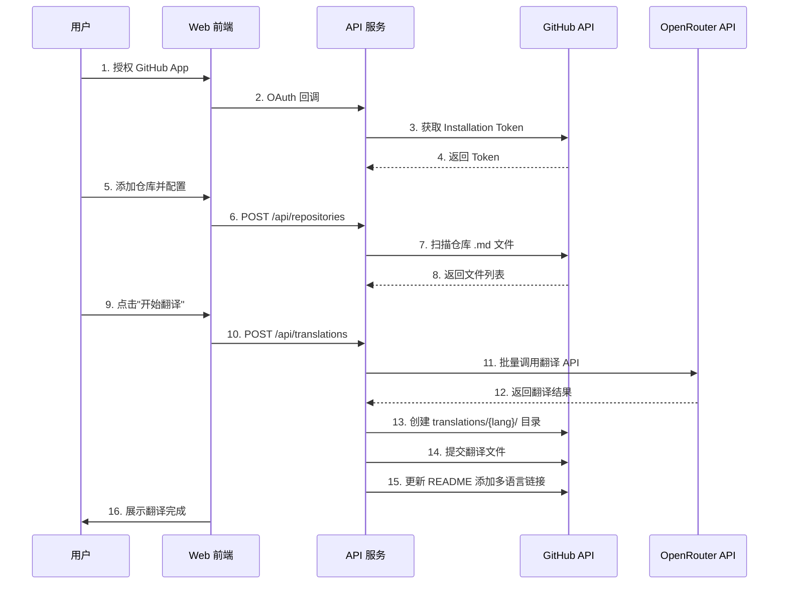
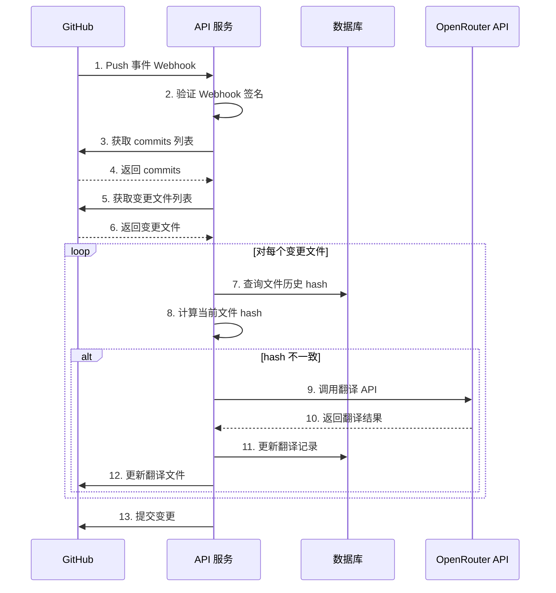

# GitHub Global - 需求规格文档

## 文档信息

| 项目 | 内容 |
|------|------|
| 项目名称 | GitHub Global (GitHub 仓库翻译工具) |
| 文档版本 | v1.0 |
| 创建日期 | 2026-03-05 |
| 文档状态 | 已确认 |

---

## 1. 项目概述

### 1.1 项目背景

开源项目 `liyupi/ai-guide` 是一套完整的 AI 编程教程，目前为纯中文版本。为了让全球用户都能访问和学习，需要将仓库文档翻译成多语言版本。

传统的翻译方式存在以下痛点：
- 人工翻译成本高、效率低
- 难以及时同步更新
- 缺乏通用的自动化解决方案

### 1.2 项目目标

开发一个通用的 GitHub 仓库翻译工具，实现：
- AI 自动翻译 GitHub 仓库文档
- 支持多语言版本管理
- 基于变更检测的自动同步
- 零配置的 SaaS 服务

### 1.3 核心价值

- 🌐 **全球化**: 帮助开源项目快速实现国际化
- 🚀 **自动化**: 减少人工翻译工作量
- 💡 **智能化**: AI 驱动的精准翻译
- 🔒 **安全性**: 企业级数据加密保护

---

## 2. 市场调研分析

### 2.1 竞品分析

#### 2.1.1 Crowdin / Transifex
- **类型**: 商业翻译管理平台
- **优势**: 功能完善，支持与 GitHub 集成
- **劣势**: 
  - 主要依赖人工翻译或众包
  - 收费较高
  - 缺乏 AI 自动翻译能力

#### 2.1.2 Markdown Docs Translator
- **类型**: 开源工具
- **优势**: 
  - 基于免费翻译 API
  - 支持 Markdown 格式
- **劣势**:
  - 缺乏自动化同步机制
  - 需要手动配置
  - 不支持 Webhook 自动触发

#### 2.1.3 Simpleen
- **类型**: AI 翻译平台
- **优势**: 
  - 支持 AI 翻译
  - 支持多种格式
- **劣势**:
  - 商业服务，成本较高
  - 缺乏与 GitHub 的深度集成

### 2.2 市场空白

通过调研发现，现有解决方案存在以下空白：
1. **缺乏基于 Git 变更检测的自动同步**
2. **缺乏通用的、零配置的 SaaS 服务**
3. **缺乏开源且免费的 AI 翻译方案**

### 2.3 技术可行性

| 技术 | 可行性 | 说明 |
|------|--------|------|
| GitHub API | ✅ 可行 | 官方提供完善的 API 文档 |
| GitHub App | ✅ 可行 | 支持 OAuth 授权和 Webhook |
| OpenRouter API | ✅ 可行 | 支持多个 AI 大模型 |
| Node.js | ✅ 可行 | 与 GitHub 生态兼容性好 |
| DeepSeek API | ✅ 可行 | 提供强大的翻译能力 |

---

## 3. 需求分析

### 3.1 用户画像

#### 3.1.1 主要用户
- **开源项目维护者**: 希望扩大项目国际影响力
- **技术文档编写者**: 需要多语言版本
- **个人开发者**: 希望快速翻译自己的项目

#### 3.1.2 用户痛点
- 手动翻译耗时耗力
- 文档更新后翻译版本滞后
- 缺乏自动化工具
- 成本较高

### 3.2 功能需求

#### 3.2.1 核心功能 (P0 - MVP 必须实现)

| 功能编号 | 功能名称 | 功能描述 | 优先级 |
|---------|---------|---------|--------|
| F01 | 用户授权 | 通过 GitHub App OAuth 授权获取仓库访问权限 | P0 |
| F02 | 仓库配置 | 输入 GitHub 仓库地址，可视化选择翻译目录 | P0 |
| F03 | 语言选择 | 选择目标语言（英语必选，其他可选） | P0 |
| F04 | AI 翻译 | 调用 OpenRouter API 进行多语言翻译 | P0 |
| F05 | 首次翻译 | 全量扫描并翻译仓库中的所有 .md 文件 | P0 |
| F06 | 变更检测 | 监听 GitHub Webhook，检测文件变更 | P0 |
| F07 | 增量翻译 | 仅翻译发生变更的文件 | P0 |
| F08 | 文件回写 | 翻译文件存储在 translations/{lang}/ 目录 | P0 |
| F09 | 自动提交 | 自动提交翻译文件到原仓库 | P0 |
| F10 | 多语言链接 | 在 README 固定位置添加多语言切换链接 | P0 |
| F11 | 进度展示 | 实时展示翻译进度 | P0 |
| F12 | 安全加密 | AES-256 加密存储用户 API Key | P0 |
| F13 | 限流控制 | 按账号限制翻译额度 | P0 |

### 3.3 非功能需求

#### 3.3.1 性能需求
- 支持并发翻译 100 个文件

#### 3.3.2 安全需求
- 用户 API Key 使用 AES-256 加密存储
- 支持 HTTPS 传输
- 实施 CSRF 防护
- 实施 XSS 防护
- 请求速率限制

#### 3.3.3 可用性需求
- 支持主流浏览器（Chrome、Firefox、Safari、Edge）

#### 3.3.4 可扩展性需求
- 支持水平扩展
- 支持新增 AI 模型
- 支持新增翻译语言

---

## 4. 系统设计

### 4.1 系统架构

```
┌─────────────────────────────────────────────────────────┐
│                      用户浏览器                           │
└──────────────────────┬──────────────────────────────────┘
                       │ HTTPS
                       ▼
┌─────────────────────────────────────────────────────────┐
│                    Web 前端层                            │
│  ┌─────────────┐  ┌─────────────┐  ┌─────────────┐     │
│  │ 仓库输入    │  │ 配置界面    │  │ 进度展示    │     │
│  └─────────────┘  └─────────────┘  └─────────────┘     │
└──────────────────────┬──────────────────────────────────┘
                       │ REST API / WebSocket
                       ▼
┌─────────────────────────────────────────────────────────┐
│                    API 服务层                            │
│  ┌─────────────┐  ┌─────────────┐  ┌─────────────┐     │
│  │ 用户认证     │  │ 任务调度     │  │ Webhook     │     │
│  └─────────────┘  └─────────────┘  └─────────────┘     │
└──────────────────────┬──────────────────────────────────┘
                       │
        ┌──────────────┼──────────────┐
        ▼              ▼              ▼
┌──────────────┐ ┌──────────┐ ┌──────────────┐
│  MySQL  │ │  本地缓存  │ │  OpenRouter  │
│   (主数据库)  │ │  (缓存)   │ │    API       │
└──────────────┘ └──────────┘ └──────────────┘
        │
        ▼
┌──────────────┐
│   GitHub API │
└──────────────┘
```

### 4.2 核心模块设计

#### 4.2.1 用户授权模块

**职责**:
- 处理 GitHub App OAuth 授权
- 生成 JWT Token
- 获取 Installation Access Token
- 管理用户会话

#### 4.2.2 翻译引擎模块

**职责**:
- 对接 OpenRouter API
- 管理翻译任务队列
- 处理批量翻译
- 优化翻译 Prompt

**支持的 AI 模型**:
- DeepSeek
- GPT-4
- Claude
- Gemini

#### 4.2.3 变更检测模块

**职责**:
- 监听 GitHub Webhook
- 获取 commits 列表
- 对比文件 hash 值
- 识别需要翻译的文件

**检测策略**:
1. **第一层**: 对比 commit 时间戳
2. **第二层**: 对比文件 hash 值 (MD5/SHA1)
3. **组合**: 确保不遗漏任何变更

#### 4.2.4 文件处理模块

**职责**:
- 解析 Markdown 文件
- 保留代码块、链接、表格等格式
- 插入多语言切换链接
- 处理图片路径

**多语言链接格式**:
```markdown
## Languages

- [English](../en/README.md)
- [中文](../zh-CN/README.md)
- [日本語](../ja/README.md)
```

#### 4.2.5 安全与限流模块

**职责**:
- AES-256 加密 API Key
- 按账号限制翻译额度
- 请求速率限制
- 防止恶意攻击

**限流策略**:
- 每个账号每天 1000000 字符免费额度
- 每秒最多 5 个请求
- 单次任务最多 100 个文件

---

## 5. 核心流程设计

### 5.1 首次翻译流程



### 5.2 增量翻译流程 (Webhook 触发)



### 5.3 文件变更检测算法

```
输入: GitHub 仓库, commits 列表

1. 获取最新的 commit SHA
2. 对比上次同步的 commit SHA
3. 获取两个 commit 之间的差异文件
4. 对于每个差异文件:
   a. 计算当前文件的 hash 值
   b. 从数据库查询历史 hash 值
   c. 如果 hash 不同,标记为需要翻译
5. 返回需要翻译的文件列表

输出: 需要翻译的文件列表
```

---

## 6. 安全设计

### 6.1 认证与授权

**GitHub App OAuth 流程**:
1. 用户点击"使用 GitHub 登录"
2. 重定向到 GitHub 授权页面
3. 用户授权后,GitHub 回调并返回 code
4. 服务器使用 code 换取 access_token
5. 生成 JWT Token 返回给客户端

### 6.2 数据加密

**API Key 加密存储**:

### 6.3 Webhook 安全

**验证 Webhook 签名**:

### 6.4 限流策略

**按账号限流**:
- 每个账号每天 1000000 字符免费额度
- 超出额度后提示升级或自备 API Key

**请求频率限制**:
- 每个账号每秒最多 5 个请求
- 每个账号每天最多 1000 次翻译任务

**单次任务限制**:
- 最多翻译 100 个文件
- 单个文件最大 10000KB

---

## 7. MVP 开发计划

### 7.1 开发阶段

#### Phase 1: 基础框架 

**任务清单**:
- [x] 搭建前后端项目结构
- [x] 配置开发环境
- [x] 实现 GitHub App 注册和配置
- [x] 实现 GitHub OAuth 授权
- [x] 设计数据库表结构
- [x] 实现 Octokit 集成
- [x] 搭建 Redis 和 PostgreSQL

**交付物**:
- 可运行的 GitHub App
- 用户授权功能
- 基础数据库结构

#### Phase 2: 核心功能 

**任务清单**:
- [x] 实现仓库添加和配置
- [x] 实现仓库文件扫描
- [x] 集成 OpenRouter API
- [x] 实现首次全量翻译
- [x] 实现文件回写功能
- [x] 实现翻译进度展示
- [x] 实现多语言链接插入

**交付物**:
- 仓库配置功能
- 首次翻译功能
- 翻译进度界面

#### Phase 3: 增量翻译

**任务清单**:
- [x] 实现 GitHub Webhook 接收
- [x] 实现 Webhook 签名验证
- [x] 实现 commits 差异分析
- [x] 实现文件 hash 计算
- [x] 实现变更检测逻辑
- [x] 实现增量翻译
- [x] 实现自动提交

**交付物**:
- Webhook 自动翻译
- 变更检测功能
- 增量翻译功能

#### Phase 4: 安全与限流

**任务清单**:
- [x] 实现 API Key 加密存储
- [x] 实现按账号限流
- [x] 实现请求频率限制
- [x] 实现 CSRF 防护
- [x] 实现 XSS 防护
- [x] 实现 HTTPS 配置

**交付物**:
- 安全功能完整
- 限流功能完整

#### Phase 5: 测试与优化

**任务清单**:
- [x] 单元测试
- [x] 集成测试
- [x] 端到端测试
- [x] 性能测试
- [x] 安全测试
- [x] Bug 修复
- [x] 文档完善

**交付物**:
- 测试报告
- 用户手册
- API 文档

### 7.2 里程碑

| 里程碑 | 时间 | 交付内容 |
|--------|------|---------|
| M1 | Week 2 | 基础框架搭建完成 |
| M2 | Week 4 | 首次翻译功能完成 |
| M3 | Week 6 | 增量翻译功能完成 |
| M4 | Week 7 | 安全和限流完成 |
| M5 | Week 8 | MVP 测试通过,可上线 |

---

## 8. 风险评估

### 8.1 技术风险

| 风险 | 影响 | 概率 | 应对措施 |
|------|------|------|---------|
| OpenRouter API 不稳定 | 高 | 中 | 多模型备选方案 |
| GitHub API 变更 | 中 | 低 | 关注 GitHub 更新,及时适配 |
| 翻译质量不佳 | 中 | 中 | 优化 Prompt,支持人工修正 |
| 并发性能不足 | 高 | 低 | 使用任务队列,水平扩展 |

### 8.2 业务风险

| 风险 | 影响 | 概率 | 应对措施 |
|------|------|------|---------|
| 用户量激增,成本超支 | 高 | 低 | 实施严格限流,引导用户自备 API Key |
| 恶意攻击 | 高 | 中 | 实施多重安全措施 |
| 竞品出现 | 中 | 高 | 快速迭代,保持技术领先 |


---

## 9. 附录

### 9.1 支持的语言列表

| 语言 | 代码 | 优先级 |
|------|------|--------|
| 英语 | en | P0 |
| 简体中文 | zh-CN | P0 |
| 繁体中文 | zh-TW | P1 |
| 日语 | ja | P1 |
| 韩语 | ko | P1 |
| 西班牙语 | es | P1 |
| 法语 | fr | P1 |
| 德语 | de | P1 |
| 俄语 | ru | P2 |
| 葡萄牙语 | pt | P2 |

### 9.2 参考文档

- [GitHub App 文档](https://docs.github.com/en/apps)
- [GitHub API 文档](https://docs.github.com/en/rest)
- [OpenRouter 文档](https://openrouter.ai/docs)
- [Octokit 文档](https://octokit.github.io/rest.js/)
- [Node.js Crypto 文档](https://nodejs.org/api/crypto.html)

---

## 10. 变更记录

| 版本 | 日期 | 变更内容 | 作者 |
|------|------|---------|------|
| v1.0 | 2026-03-05 | 初始版本 | AI Agent |

---

**文档结束**
