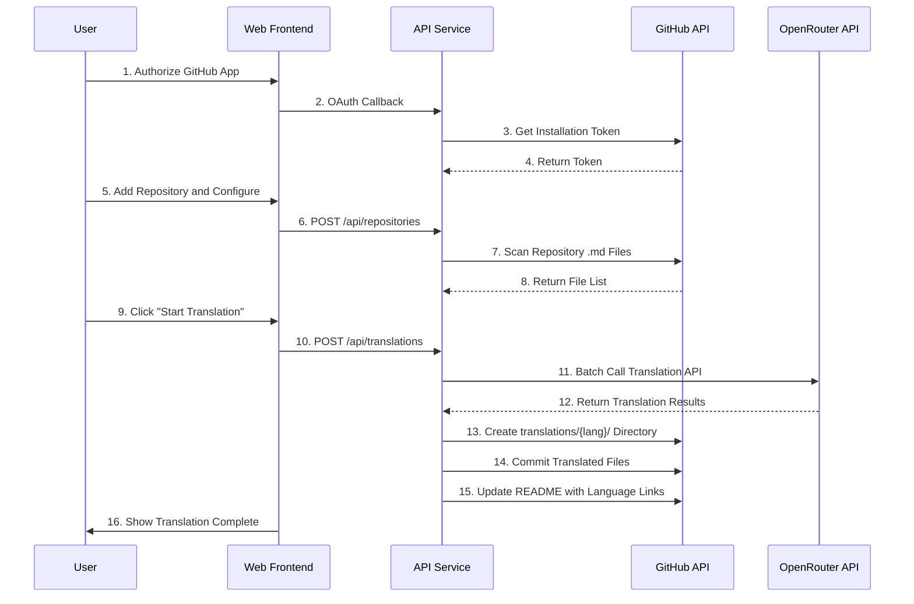
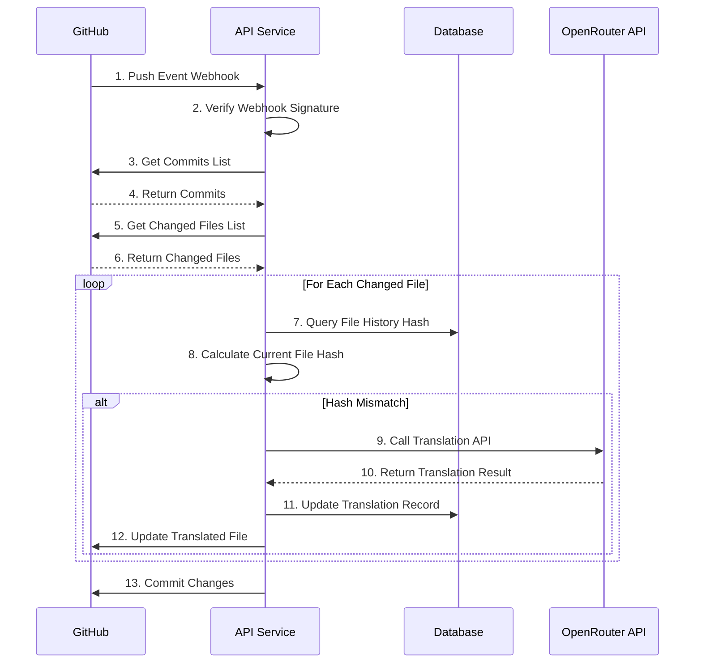

# GitHub Global - Requirements Specification Document

## Document Information

| Item | Content |
|------|------|
| Project Name | GitHub Global (GitHub Repository Translation Tool) |
| Document Version | v1.0 |
| Creation Date | 2026-03-05 |
| Document Status | Confirmed |

---

## 1. Project Overview

### 1.1 Project Background

The open-source project `liyupi/ai-guide` is a comprehensive AI programming tutorial currently available only in Chinese. To make it accessible to global users, the repository documentation needs to be translated into multiple languages.

Traditional translation methods have the following pain points:
- High cost and low efficiency of manual translation
- Difficulty in synchronizing updates promptly
- Lack of a universal automated solution

### 1.2 Project Objectives

Develop a universal GitHub repository translation tool to achieve:
- AI-powered automatic translation of GitHub repository documentation
- Support for multilingual version management
- Automatic synchronization based on change detection
- Zero-configuration SaaS service

### 1.3 Core Value

- 🌐 **Globalization**: Help open-source projects achieve internationalization quickly
- 🚀 **Automation**: Reduce manual translation workload
- 💡 **Intelligence**: AI-driven precise translation
- 🔒 **Security**: Enterprise-grade data encryption protection

---

## 2. Market Research Analysis

### 2.1 Competitive Analysis

#### 2.1.1 Crowdin / Transifex
- **Type**: Commercial translation management platform
- **Advantages**: Feature-rich, supports GitHub integration
- **Disadvantages**:
  - Primarily relies on manual or crowdsourced translation
  - High cost
  - Lacks AI-powered automatic translation capability

#### 2.1.2 Markdown Docs Translator
- **Type**: Open-source tool
- **Advantages**:
  - Uses free translation APIs
  - Supports Markdown format
- **Disadvantages**:
  - Lacks automated synchronization mechanism
  - Requires manual configuration
  - Does not support Webhook auto-triggering

#### 2.1.3 Simpleen
- **Type**: AI translation platform
- **Advantages**:
  - Supports AI translation
  - Supports multiple formats
- **Disadvantages**:
  - Commercial service with high cost
  - Lacks deep integration with GitHub

### 2.2 Market Gaps

Research reveals the following gaps in existing solutions:
1. **Lacks Git change detection-based auto-synchronization**
2. **Lacks a universal, zero-configuration SaaS service**
3. **Lacks an open-source and free AI translation solution**

### 2.3 Technical Feasibility

| Technology | Feasibility | Description |
|------|--------|------|
| GitHub API | ✅ Feasible | Official comprehensive API documentation |
| GitHub App | ✅ Feasible | Supports OAuth authorization and Webhook |
| OpenRouter API | ✅ Feasible | Supports multiple AI models |
| Node.js | ✅ Feasible | Good compatibility with GitHub ecosystem |
| DeepSeek API | ✅ Feasible | Provides powerful translation capabilities |

---

## 3. Requirements Analysis

### 3.1 User Profiles

#### 3.1.1 Primary Users
- **Open-source project maintainers**: Want to expand project's international influence
- **Technical document writers**: Need multilingual versions
- **Individual developers**: Want to quickly translate their projects

#### 3.1.2 User Pain Points
- Time-consuming and labor-intensive manual translation
- Translated versions lag behind document updates
- Lack of automation tools
- High cost

### 3.2 Functional Requirements

#### 3.2.1 Core Features (P0 - MVP Must Implement)

| Feature ID | Feature Name | Feature Description | Priority |
|---------|---------|---------|--------|
| F01 | User Authorization | Obtain repository access via GitHub App OAuth authorization | P0 |
| F02 | Repository Configuration | Input GitHub repository address, visually select translation directories | P0 |
| F03 | Language Selection | Select target languages (English required, others optional) | P0 |
| F04 | AI Translation | Call OpenRouter API for multilingual translation | P0 |
| F05 | Initial Translation | Full scan and translation of all .md files in the repository | P0 |
| F06 | Change Detection | Listen to GitHub Webhook, detect file changes | P0 |
| F07 | Incremental Translation | Translate only changed files | P0 |
| F08 | File Write-back | Store translated files in translations/{lang}/ directory | P0 |
| F09 | Auto-Commit | Automatically commit translated files to the original repository | P0 |
| F10 | Multilingual Links | Add language-switching links in a fixed README location | P0 |
| F11 | Progress Display | Real-time translation progress display | P0 |
| F12 | Security Encryption | AES-256 encrypted storage of user API Key | P0 |
| F13 | Rate Limiting | Limit translation quota per account | P0 |

### 3.3 Non-Functional Requirements

#### 3.3.1 Performance Requirements
- Support concurrent translation of 100 files

#### 3.3.2 Security Requirements
- User API Key stored with AES-256 encryption
- HTTPS transmission support
- CSRF protection
- XSS protection
- Request rate limiting

#### 3.3.3 Usability Requirements
- Support mainstream browsers (Chrome, Firefox, Safari, Edge)

#### 3.3.4 Scalability Requirements
- Support horizontal scaling
- Support adding new AI models
- Support adding new translation languages

---

## 4. System Design

### 4.1 System Architecture

```
┌─────────────────────────────────────────────────────────┐
│                      User Browser                        │
└──────────────────────┬──────────────────────────────────┘
                       │ HTTPS
                       ▼
┌─────────────────────────────────────────────────────────┐
│                    Web Frontend Layer                    │
│  ┌─────────────┐  ┌─────────────┐  ┌─────────────┐     │
│  │ Repository  │  │ Config UI   │  │ Progress    │     │
│  │ Input       │  │             │  │ Display     │     │
│  └─────────────┘  └─────────────┘  └─────────────┘     │
└──────────────────────┬──────────────────────────────────┘
                       │ REST API / WebSocket
                       ▼
┌─────────────────────────────────────────────────────────┐
│                    API Service Layer                     │
│  ┌─────────────┐  ┌─────────────┐  ┌─────────────┐     │
│  │ User Auth   │  │ Task        │  │ Webhook     │     │
│  │             │  │ Scheduling  │  │ Handling    │     │
│  └─────────────┘  └─────────────┘  └─────────────┘     │
└──────────────────────┬──────────────────────────────────┘
                       │
        ┌──────────────┼──────────────┐
        ▼              ▼              ▼
┌──────────────┐ ┌──────────┐ ┌──────────────┐
│  MySQL       │ │  Local   │ │  OpenRouter  │
│  (Primary DB) │ │  Cache   │ │    API       │
└──────────────┘ └──────────┘ └──────────────┘
        │
        ▼
┌──────────────┐
│   GitHub API │
└──────────────┘
```

### 4.2 Core Module Design

#### 4.2.1 User Authorization Module

**Responsibilities**:
- Handle GitHub App OAuth authorization
- Generate JWT Token
- Obtain Installation Access Token
- Manage user sessions

#### 4.2.2 Translation Engine Module

**Responsibilities**:
- Integrate with OpenRouter API
- Manage translation task queue
- Handle batch translation
- Optimize translation prompts

**Supported AI Models**:
- DeepSeek
- GPT-4
- Claude
- Gemini

#### 4.2.3 Change Detection Module

**Responsibilities**:
- Listen to GitHub Webhook
- Get commits list
- Compare file hash values
- Identify files needing translation

**Detection Strategy**:
1. **First Layer**: Compare commit timestamps
2. **Second Layer**: Compare file hash values (MD5/SHA1)
3. **Combination**: Ensure no changes are missed

#### 4.2.4 File Processing Module

**Responsibilities**:
- Parse Markdown files
- Preserve code blocks, links, tables, etc.
- Insert language-switching links
- Handle image paths

**Multilingual Link Format**:
```markdown
## Languages

- [English](../en/README.md)
- [中文](../zh-CN/README.md)
- [日本語](../ja/README.md)
```

#### 4.2.5 Security and Rate Limiting Module

**Responsibilities**:
- AES-256 encrypt API Key
- Limit translation quota per account
- Request rate limiting
- Prevent malicious attacks

**Rate Limiting Strategy**:
- 1,000,000 free characters per account daily
- Max 5 requests per second
- Max 100 files per task

---

## 5. Core Process Design

### 5.1 Initial Translation Process



### 5.2 Incremental Translation Process (Webhook Triggered)



### 5.3 File Change Detection Algorithm

```
Input: GitHub Repository, Commits List

1. Get latest commit SHA
2. Compare with last synced commit SHA
3. Get diff files between two commits
4. For each diff file:
   a. Calculate current file hash
   b. Query historical hash from DB
   c. If hash differs, mark for translation
5. Return files needing translation

Output: Files needing translation list
```

---

## 6. Security Design

### 6.1 Authentication and Authorization

**GitHub App OAuth Flow**:
1. User clicks "Login with GitHub"
2. Redirect to GitHub authorization page
3. After user authorization, GitHub callback returns code
4. Server exchanges code for access_token
5. Generate JWT Token and return to client

### 6.2 Data Encryption

**API Key Encryption Storage**:

### 6.3 Webhook Security

**Verify Webhook Signature**:

### 6.4 Rate Limiting Strategy

**Per-Account Rate Limiting**:
- 1,000,000 free characters per account daily
- Prompt to upgrade or provide own API Key beyond quota

**Request Frequency Limits**:
- Max 5 requests per second per account
- Max 1000 translation tasks daily per account

**Per-Task Limits**:
- Max 100 files per translation
- Max 10000KB per file

---

## 7. MVP Development Plan

### 7.1 Development Phases

#### Phase 1: Foundation Framework 

**Task List**:
- [x] Set up frontend/backend project structure
- [x] Configure development environment
- [x] Implement GitHub App registration and configuration
- [x] Implement GitHub OAuth authorization
- [x] Design database schema
- [x] Implement Octokit integration
- [x] Set up Redis and PostgreSQL

**Deliverables**:
- Functional GitHub App
- User authorization feature
- Basic database structure

#### Phase 2: Core Features 

**Task List**:
- [x] Implement repository addition and configuration
- [x] Implement repository file scanning
- [x] Integrate OpenRouter API
- [x] Implement initial full translation
- [x] Implement file write-back
- [x] Implement translation progress display
- [x] Implement multilingual link insertion

**Deliverables**:
- Repository configuration feature
- Initial translation feature
- Translation progress interface

#### Phase 3: Incremental Translation

**Task List**:
- [x] Implement GitHub Webhook reception
- [x] Implement Webhook signature verification
- [x] Implement commits diff analysis
- [x] Implement file hash calculation
- [x] Implement change detection logic
- [x] Implement incremental translation
- [x] Implement auto-commit

**Deliverables**:
- Webhook auto-translation
- Change detection feature
- Incremental translation feature

#### Phase 4: Security and Rate Limiting

**Task List**:
- [x] Implement API Key encryption storage
- [x] Implement per-account rate limiting
- [x] Implement request frequency limits
- [x] Implement CSRF protection
- [x] Implement XSS protection
- [x] Implement HTTPS configuration

**Deliverables**:
- Complete security features
- Complete rate limiting features

#### Phase 5: Testing and Optimization

**Task List**:
- [x] Unit testing
- [x] Integration testing
- [x] End-to-end testing
- [x] Performance testing
- [x] Security testing
- [x] Bug fixes
- [x] Documentation refinement

**Deliverables**:
- Test reports
- User manual
- API documentation

### 7.2 Milestones

| Milestone | Time | Deliverables |
|--------|------|---------|
| M1 | Week 2 | Foundation framework completed |
| M2 | Week 4 | Initial translation feature completed |
| M3 | Week 6 | Incremental translation feature completed |
| M4 | Week 7 | Security and rate limiting completed |
| M5 | Week 8 | MVP tested and ready for launch |

---

## 8. Risk Assessment

### 8.1 Technical Risks

| Risk | Impact | Probability | Mitigation |
|------|------|------|---------|
| OpenRouter API instability | High | Medium | Multi-model fallback |
| GitHub API changes | Medium | Low | Monitor GitHub updates, adapt promptly |
| Poor translation quality | Medium | Medium | Optimize prompts, allow manual corrections |
| Insufficient concurrency | High | Low | Use task queues, horizontal scaling |

### 8.2 Business Risks

| Risk | Impact | Probability | Mitigation |
|------|------|------|---------|
| Surge in users, cost overrun | High | Low | Strict rate limiting, guide users to provide own API Key |
| Malicious attacks | High | Medium | Implement multi-layer security measures |
| Competitor emergence | Medium | High | Rapid iteration, maintain technical lead |

---

## 9. Appendix

### 9.1 Supported Languages List

| Language | Code | Priority |
|------|------|--------|
| English | en | P0 |
| Simplified Chinese | zh-CN | P0 |
| Traditional Chinese | zh-TW | P1 |
| Japanese | ja | P1 |
| Korean | ko | P1 |
| Spanish | es | P1 |
| French | fr | P1 |
| German | de | P1 |
| Russian | ru | P2 |
| Portuguese | pt | P2 |

### 9.2 Reference Documents

- [GitHub App Documentation](https://docs.github.com/en/apps)
- [GitHub API Documentation](https://docs.github.com/en/rest)
- [OpenRouter Documentation](https://openrouter.ai/docs)
- [Octokit Documentation](https://octokit.github.io/rest.js/)
- [Node.js Crypto Documentation](https://nodejs.org/api/crypto.html)

---

## 10. Change Log

| Version | Date | Changes | Author |
|------|------|---------|------|
| v1.0 | 2026-03-05 | Initial version | AI Agent |

---

**End of Document**